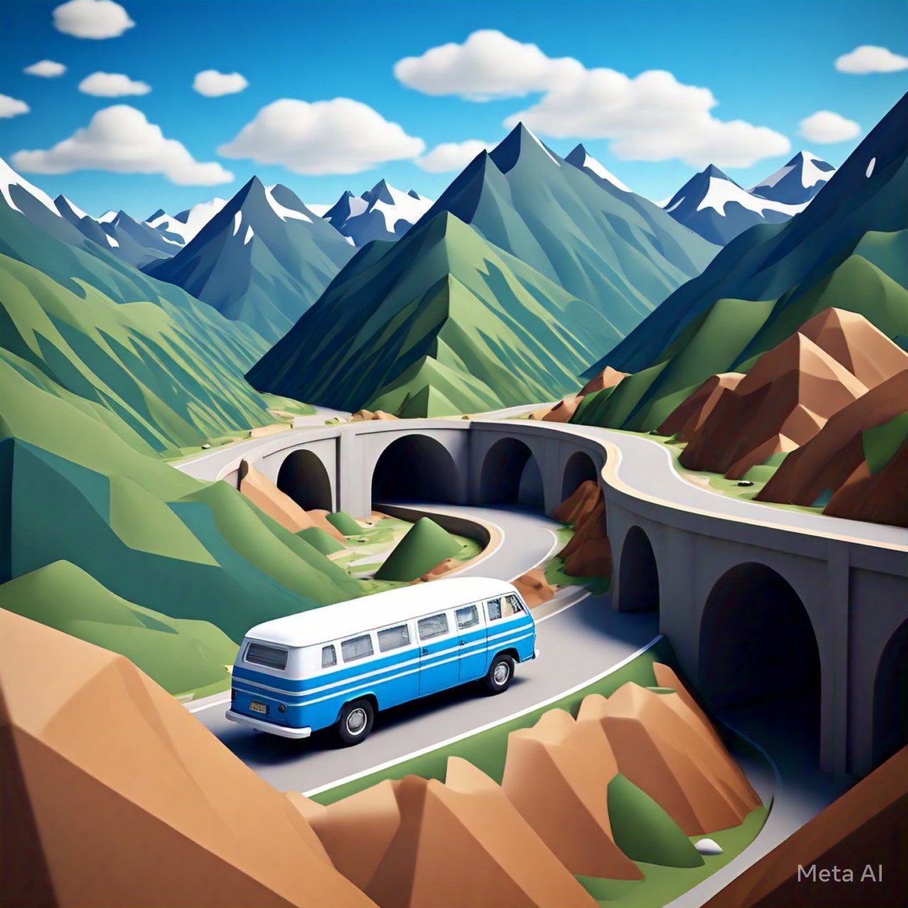
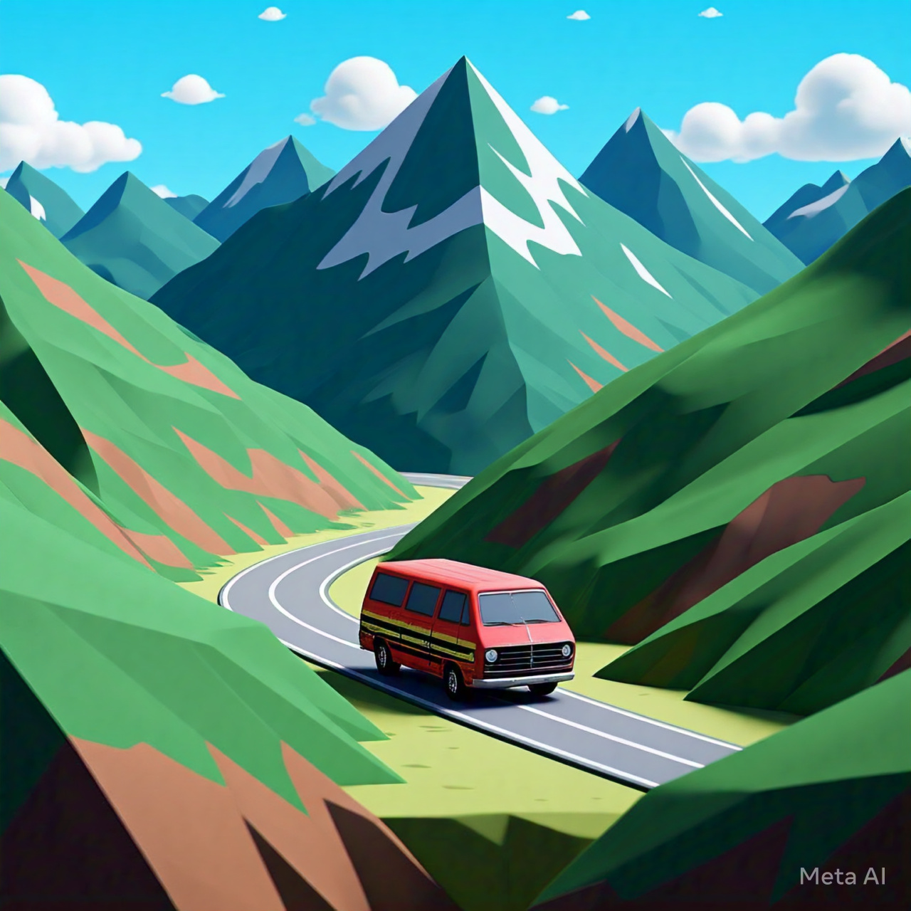

# Overview

This portfolio project is designed to enhance my skills in 3D rendering within a web environment. To ensure a meaningful and engaging user experience, I have scoped the project to be compact yet comprehensive, integrating various key concepts in 3D development. The inspiration for this project comes from foundational topics in 3D modeling, such as procedural meshes, heightmaps, triplanar mapping, and shader programming.

## Coding goals

The primary goal is to create an interactive terrain mesh representing a mountainous landscape that users can modify through terraforming. The altered terrain will then be used to compute an optimal path between user-defined points, where a road will be rendered.

The criteria for determining the optimal path will incorporate real-world considerations, such as terrain steepness and landmass transportation challenges. For added complexity and interactivity, the project will include features like tunnels and bridges to navigate difficult terrain sections. These elements aim to make the project both technically challenging and visually engaging.

## Visual reference

The rendering style will feature a distinctive cel-shaded aesthetic, inspired by AI-generated visual references. Key elements of the visual style include:

- **Cel-Shaded Rendering**: implements a stylized, cartoon-like shading technique to give the environment a unique, artistic appearance.
- **Miniature Diorama Aesthetic**: creates a small-scale, model-like look to enhance visual appeal and user immersion.
- **Car Mesh Rendering**: includes realistic yet stylized rendering of car models within the terrain.
- **Diverse Terrain Types**: showcases varying terrain features, such as rivers, mountains, and flatlands, rendered with distinct visual details.

|  |  |  |
| ------------------------------------------------- | ------------------------------------------------- | ------------------------------------------------- |
|  |  |  |

# Features

- **Procedural Mesh Generation**: dynamically creates terrain geometry based on user input;
- **Heightmaps**: uses grayscale images to define terrain elevation, enabling detailed and natural-looking landscapes.
- **Triplanar Mapping**: applies textures seamlessly to complex terrain surfaces to create a pleasing representarion of the landscape;
- **User Input Brushes**: allows users to modify the terrain interactively by "painting" changes, such as raising or lowering the land.
- **Optimal Path Search**: computes efficient road paths based on user-defined points, considering terrain steepness of the terrain
- **Mesh Rendering**: renders the modified terrain and road in real time, providing immediate visual feedback for all changes.

## Technologies Used

- **JavaScript**: Core programming language for interactivity, logic, and DOM manipulation.
- **Three.js**: A high-level library built on WebGL to simplify 3D graphics creation and rendering.
- **WebGL**: Low-level API for rendering 2D and 3D graphics directly within the browser.
- **GLSL (OpenGL Shading Language)**: Used for writing custom shaders to achieve advanced rendering effects like cel shading and triplanar mapping.
- **HTML5**: Provides the structure for the application, including canvas elements for rendering.
- **CSS3**: Styles the interface and enhances the visual experience.

## Project roadmap

- **feat/001/Procedural Mesh Creation**: Generate a base mesh for the terrain using algorithms like Perlin or simplex noise.
- **feat/002/Heightmap Integration**: Use grayscale images to apply elevation data to the terrain.
- **feat/003/Dynamic Mesh Updates**: Enable real-time updates to the terrain based on user interactions.
- **feat/004/Triplanar Mapping**: Apply textures to the terrain to avoid distortions and ensure seamless transitions between surfaces.
- **feat/005/Implement Custom Shading**: Write GLSL shaders to achieve a cel-shaded look and enhance texture details.
- **feat/006/Brush Tool Implementation**: Allow users to interact with the terrain using tools to raise, lower, or flatten sections.
- **feat/007/Create UI Elements**: Create a user-friendly interface for brush size, intensity, and terrain modification settings.
- **feat/008/Optimal Pathfinding Algorithm**: Implement pathfinding logic (e.g., A\* or Dijkstra's algorithm) to calculate efficient routes based on terrain data.
- **feat/009/Road Mesh Generation**: Dynamically create and render a road mesh following the computed path.
- **feat/010/Bridges and Tunnels**: Add logic to detect terrain features and generate bridges or tunnels where necessary.
- **feat/011/Real-Time Rendering**: Use Three.js and WebGL to render the environment with interactive performance.
- **feat/012/Optimize Level of Detail (LOD)**: Adjust mesh detail dynamically based on the camera's distance from objects.
- **feat/013/Implement Shadow and Lighting Effects**: Add realistic and stylized lighting to enhance visual depth.
- **feat/014/Import and Render Car Models**: Integrate stylized car meshes that interact with the terrain.
- **feat/015/Object Placement**: Allow for the addition of static or dynamic objects like trees, rocks, and buildings.
- **feat/016/Performance Testing**: Monitor frame rates and optimize code for smooth rendering across devices.
- feat/018/Packaging: Use tools like Webpack to bundle assets and scripts for efficient deployment.
- **feat/019/Hosting**: Deploy the application to a web server or platform like GitHub Pages or Vercel.
